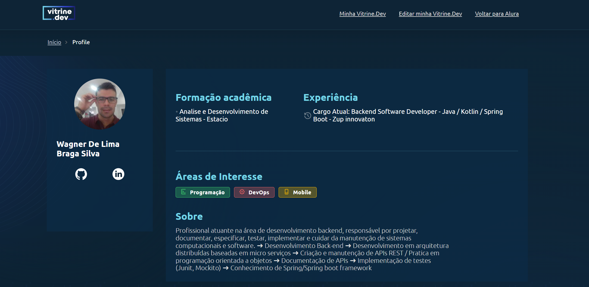

# Microsserviço de pagamento

* Foi desenvolvido do zero o microsserviço de pagamentos, onde foi criado controlador, modelos, dto (data transfer object), repository.
* A Aplicação se conecta com um banco de dados MySQL.
* Foi utilizada uma arquitetura de microsserviços, fazendo service discovery, centralizando requisições através de um API Gateway, fazendo balanceamento de carga.
* Foi implementado uma comunicação síncrona usando ferramentas do Spring Cloud, além de projetar conceitos de circuit breaker e fallback para prevenir falhas ou inoperabilidade em algum dos microsserviços.

| :placard: Vitrine.Dev |     |
| -------------  | --- |
| :sparkles: Nome        | **Microsserviço de pagamento**
| :label: Tecnologias | SpringBoot, Java, MySQL, Maven
| :rocket: URL         | https://url-deploy.com.br
| :fire: Desafio     | https://www.alura.com.br/curso-online-microsservicos-implementando-java-spring

<!-- Inserir imagem com a #vitrinedev ao final do link -->

[url-vitrine-dev](https://cursos.alura.com.br/vitrinedev/wagner-sistemalima)

## Setup do Projeto
* Linguagem de programação: Java
* Tecnologia: Spring Boot 2.6.13
* Gerenciador de dependência: Maven
* Java 17
* IDE IntelJ

## Implementação utilizando as ferramentas do ecossistema Spring com Java 17
* Spring Web: Crie aplicativos da web, incluindo RESTful, usando Spring MVC. Usa Apache Tomcat como o contêiner integrado padrão.
* Bean Validation: é uma especificação que permite validar objetos com facilidade em diferentes camadas da aplicação. A vantagem de usar Bean Validation é que as restrições ficam inseridas nas classes de modelo.
* Spring Cloud OpenFeign: Uma maneira elegante de criar clientes HTTP em Java
* JPA : biblioteca padrão de persistência de dados no java, baseado no mapeamento objeto relacional
* Banco de dados MySQL